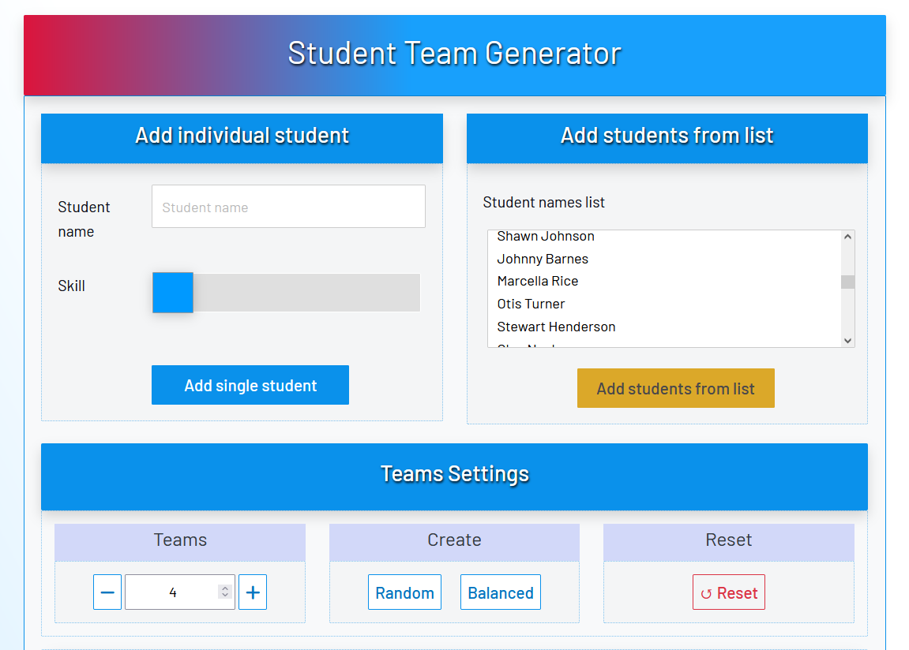
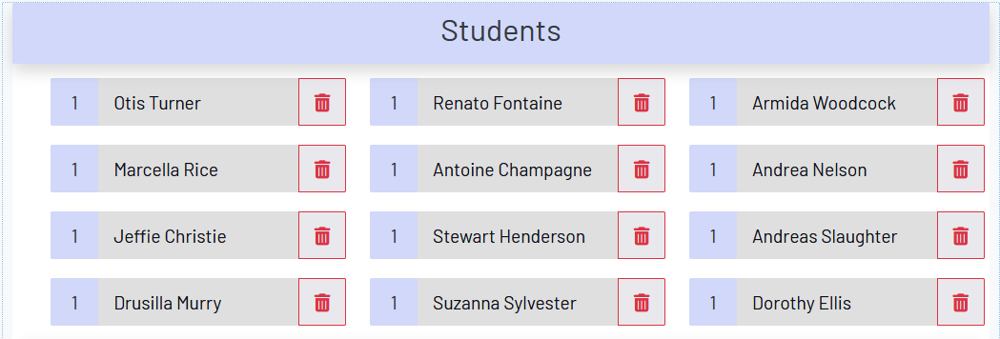
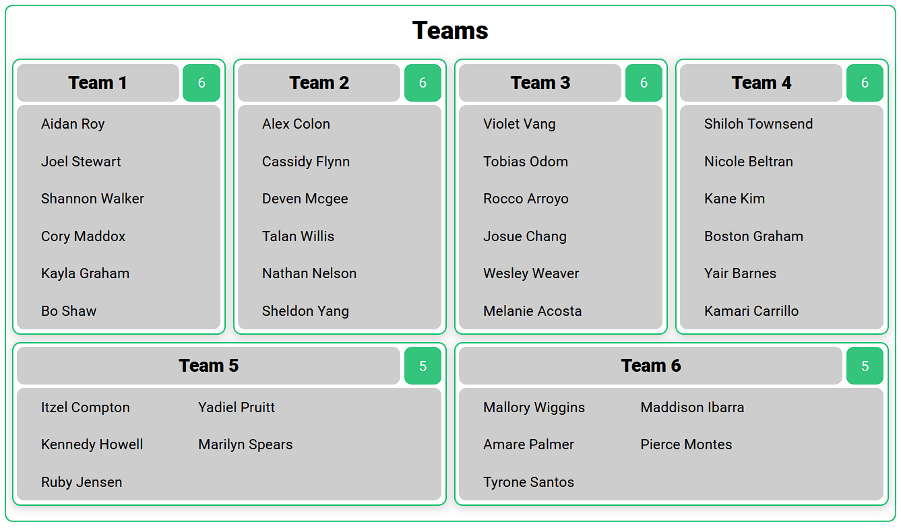

**********************
student-team-generator
**********************

Tool for conveniently generating random teams of students from a list of names.
Forked from Raybawn (https://github.com/Raybawn/random-team-generator) and modified for classroom use.

User the Generator
##################

`Use Student Team Generator <https://htmlpreview.github.io/?https://github.com/haasr/student-team-generator/blob/master/index.html>`_

Added Features
##############

- Ability to copy and paste a list of students' names, and then import that list
- Reset button to clear existing teams and imported students
- Card view of teams to facilitate presenting larger team sizes on one screen (for my students to see their teams)
- Auto-scroll to the **Teams** section after team generation
- More natural padding, border, use of contrast, and depth
- Improved responsiveness of layout
- Implemented player IDs in the JavaScript to work around the problem of names with spaces breaking the *delete* functionality
